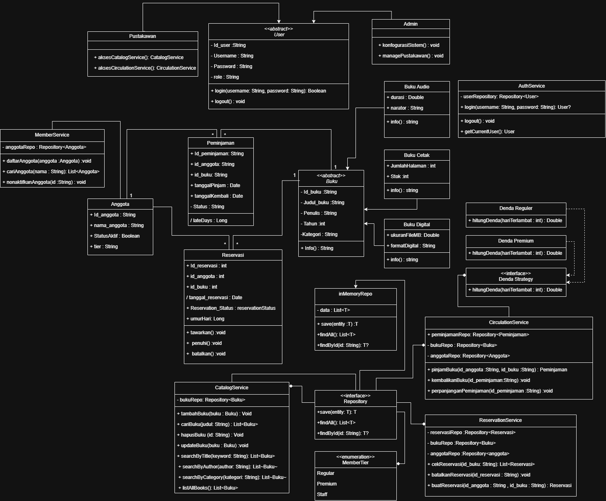

# Proyek Sistem Perpustakaan - AkasiaLib

AkasiaLib adalah aplikasi Command-Line Interface (CLI) sederhana untuk manajemen perpustakaan, yang dibangun menggunakan Kotlin dengan prinsip-prinsip Object-Oriented Programming (OOP).

---

## Anggota Tim & Kontribusi

| Peran | Nama                          | NIM       | Kontribusi Spesifik |
| :--- |:------------------------------|:----------| :--- |
| **1. Analis & Desainer** | Dien Putri Alexa              | 224443028 | Menganalisis kebutuhan dan merancang struktur kelas dan relasi sesuai spesifikasi tugas (UML). |
| **2. Implementasi Model & Repository** | Abyan Maheswara               | 224443024 | - Membuat semua data class dan abstract class di direktori `model` (`Buku`, `BukuCetak`, `BukuDigital`, `Anggota`, `Peminjaman`, `Reservasi`).<br>- Mengimplementasikan `interface Identifiable` untuk type safety.<br>- Membuat repositori generik `InMemoryRepo<T>` untuk manajemen data di memori. |
| **3. Implementasi Service & Logika Bisnis** | Altaf Fazli Sakha             | 224443025 | - Membuat `CatalogService` dan `MemberService` untuk manajemen data dasar.<br>- Mengimplementasikan `ReservationService` untuk logika antrian.<br>- Membangun `CirculationService` yang berisi logika bisnis inti: peminjaman, pengembalian, perhitungan denda, dan pengecekan batas pinjam. |
| **4. Implementasi CLI & Laporan** | Muhammad Irsyad Salim Nugraha | 224443036 | - Membangun antarmuka CLI interaktif di `Main.kt`.<br>- Mengimplementasikan fungsi untuk menjalankan skenario uji wajib secara otomatis.<br>- Membuat fungsi-fungsi untuk menampilkan laporan (pinjaman aktif, buku terpopuler, total denda, antrian reservasi). |

---

## Cara Menjalankan Aplikasi

Pastikan Anda memiliki JDK (Java Development Kit) yang terinstal.

1.  Buka terminal atau command prompt di direktori root proyek.
2.  Jalankan perintah berikut:

    ```bash
    # Untuk Windows
    .\gradlew.bat run

    # Untuk macOS/Linux
    ./gradlew run
    ```
3.  Aplikasi akan pertama-tama menjalankan skenario uji otomatis, lalu menampilkan menu interaktif.

---

## Sistem Login AkasiaLib
```
=== ? Sistem Login AkasiaLib ===
Username:
Password:
```

---

## Hasil Skenario Uji Wajib

Saat dijalankan, program akan secara otomatis mengeksekusi skenario yang diminta dalam dokumen tugas. Hasilnya adalah sebagai berikut:

1.  **Inisialisasi Data**: 5 buku dan 3 anggota berhasil ditambahkan.
2.  **Peminjaman REGULAR**: Anggota "Andi" berhasil meminjam 2 buku.
3.  **Peminjaman PREMIUM**: Anggota "Siti" berhasil meminjam 1 buku digital.
4.  **Gagal Pinjam & Reservasi**: Anggota "Rahmat" gagal meminjam buku yang stoknya habis, lalu berhasil membuat reservasi untuk buku tersebut.
5.  **Pengembalian Terlambat**: Sebuah skenario pengembalian buku yang terlambat 3 hari disimulasikan, dan denda sebesar **Rp 3000** berhasil dihitung.
6.  **Notifikasi Reservasi**: Setelah buku dikembalikan, sistem menampilkan notifikasi bahwa buku tersebut kini ditawarkan kepada "Rahmat" yang ada di antrian.
7.  **Laporan**: Laporan total denda dan buku terpopuler ditampilkan dengan benar di akhir skenario.

Semua skenario uji wajib berhasil dijalankan sesuai ekspektasi.

💡 Tugas Tambahan (Opsional, Bonus 10–20%)

Implementasikan pattern Strategy untuk perhitungan denda.

Tambahkan class BukuAudio (durasi, narrator) dengan aturan peminjaman berbeda.

Tambahkan ekspor laporan ke CSV.

Implementasikan autonumber ID otomatis (BK-0001, AG-0001, dst).

Buat sesi login sederhana (Admin vs Pustakawan).

## Class Diagram
